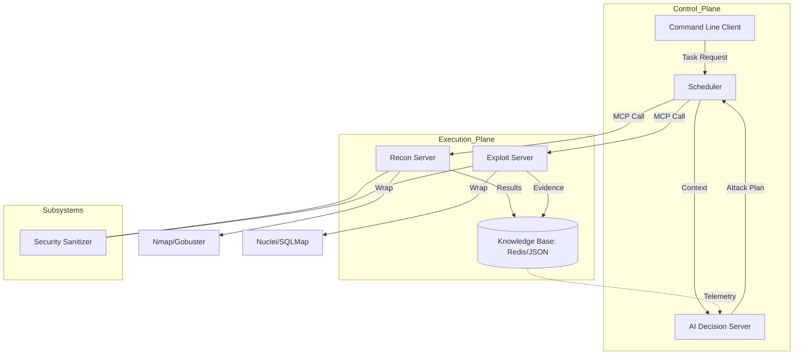

# Technical Specification Document (TSD) - MCP_scan

## 1. System Architecture
MCP_scan is a distributed penetration testing system based on the Model Context Protocol (MCP). It decouples the decision-making brain (AI), the coordination heart (Scheduler), and the execution limbs (Recon/Exploit Servers).

## 2. Technology Stack
- **Languages**: Python 3.10+ (Core), Shell (Deployment)
- **Frameworks**: 
    - **FastAPI**: Providing REST/SSE interfaces for MCP Servers.
    - **Pydantic v2**: Strict data validation for MCP messages.
- **Communication**: 
    - **MCP Protocol**: JSON-RPC over HTTP/SSE.
    - **Redis**: As a distributed message broker and transient result cache.
- **AI/LLM**: 
    - **Integrations**: OpenAI/Anthropic/Gemini (via AI Server models).
- **Security Tools**: Nmap, Nuclei, Sqlmap, Gobuster.

## 3. Key Design Decisions

### 3.1. Tool-as-a-Service (MaaS)
- **Decision**: Every security tool is encapsulated as an MCP Capability.
- **Rationale**: Decouples logic from tool syntax. Allows the AI to invoke "port_scan" without knowing Nmap's complex flags.

### 3.2. DAG-based Task Scheduling
- **Decision**: Use Directed Acyclic Graphs (DAG) for mission execution.
- **Rationale**: Security tasks often depend on each other (e.g., can't exploit until ports are found). A DAG ensures correct order and parallel execution where possible.

### 3.3. Command Sanitization Layer
- **Decision**: Mandatory regex-based shell injection filtering in `core/security/`.
- **Rationale**: Since tools are invoked via wrappers, we must prevent accidental command injection from malformed inputs.

## 4. Subsystem Detailed Design

### 4.1. Scheduler (The Coordinator)
- **Workflow**:
    1. Receives target from Client.
    2. Requests decomposition from **AI Server**.
    3. Builds DAG of tasks.
    4. Dispatches tasks to available **Recon/Exploit Nodes** via MCP.
    5. Monitors state and updates **Knowledge Model**.

### 4.2. AI Decision Engine
- **Attack Chain Builder**: Analyzes `asset_model` to identify high-value targets.
- **Feedback Loop**: If a Nuclei scan fails or returns "low risk", the AI re-triggers the `subdomain_enum` to find wider attack surfaces.

### 4.3. Knowledge Model (KM)
- **Asset Schema**: Tracks IP, Hostname, Ports, Services, OS.
- **Vulnerability Schema**: Maps CVE IDs to successful exploit evidence.

## 5. Deployment Plan
### 5.1. Target Environment
- **OS**: Kali Linux (Native or Virtual Machine).
- **Prerequisites**: Python 3.10+, Redis (Local), and target security tools (Nmap, Nuclei, etc.) pre-installed and available in `$PATH`.

### 5.2. Execution Modes
- **Local Mono-node**: Run all components (Scheduler, AI, Servers) on a single Kali instance.
- **Distributed Control**: Deploy the Scheduler on a main machine and trigger execution on remote Kali nodes via SSH or direct Python execution.

### 5.3. Startup Process
- Components are started directly via Python modules (e.g., `python -m servers.recon.recon_server`).
- Centralized management via the provided `start.sh` and `stop.sh` scripts.

