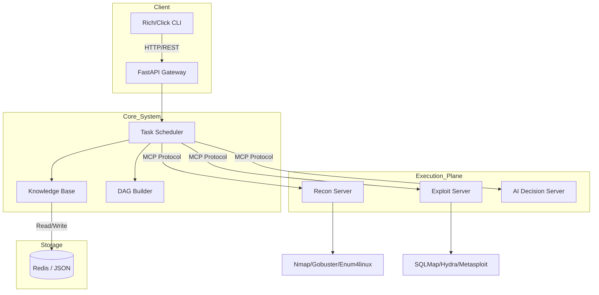

# Technical Specification Document (TSD) - MCP_scan

## 1. System Architecture

The system adopts a **Simplified Distributed Architecture** optimized for local and lab environments.

### 1.1. Planning & Research Context
> [!NOTE]
> This architecture is derived from `PROJECT_STRUCTURE_SIMPLIFIED.md` and leverages the proven `MCP_kali` tool interfaces.

## 2. Technology Stack
- **Language**: Python 3.8+
- **Web Framework**: FastAPI (for MCP server endpoints)
- **Protocol**: MCP (Model Context Protocol) over HTTP/SSE
- **Data Model**: Pydantic v2
- **State Management**: Redis (Queue & Asset Store)
- **CLI**: Click + Rich
- **Deployment**: Docker Compose / Systemd

## 3. Subsystem Design

### 3.1. Core System (`core/`)
- **scheduler/distributed_executor.py**: Manages the lifecycle of scan jobs. Breaks down high-level objectives into tool-specific tasks.
- **knowledge/asset_model.py**: Stores the "World View" (IPs, Ports, Services).
- **mcp/registry.py**: Auto-discovers available capabilities from registered servers.

### 3.2. Servers (`servers/`)
Based on `MCP_kali` implementation patterns:

- **Recon Server** (`servers/recon/`):
  - Wraps Nmap, Gobuster, Dirb, Enum4linux.
  - Normalizes output into JSON for the Knowledge Base.

- **Exploit Server** (`servers/exploit/`):
  - Wraps SQLMap, Hydra, John, Metasploit, WPScan.
  - Handles sensitive operations with "Human-in-the-loop" approval checks (simulated or CLI prompt).

- **AI Server** (`servers/ai/`):
  - Analyzes simplified scan results.
  - Suggests next steps (e.g., "Found WordPress -> Suggest WPScan").

### 3.3. Communication
- **Node Manager**: Handles heartbeat and reachability of execution nodes.
- **Message Router**: Routes MCP JSON-RPC messages between Scheduler and Tools.

## 4. Requirement Mapping

| Feature | Requirement | Component Implementation |
| :--- | :--- | :--- |
| **Tool Support** | Prd F1 | `servers/recon/capabilities/*.py`, `servers/exploit/capabilities/*.py` |
| **Scheduler** | Prd F2 | `core/scheduler/dag_builder.py` |
| **CLI** | Prd F3 | `client/cli.py` (using Rich/Click) |
| **Asset Storage** | NFR-Data | `core/knowledge/` + Redis |
| **Security** | NFR-Sec | Pydantic validation on all Tool arguments |

## 5. Security Architecture
- **Input Validation**: Strict typing via Pydantic models prevents common command injection vectors.
- **Execution Isolation**: Tools run in subprocesses; Docker containerization recommended for isolation.
- **API Security**: Simple API Key authentication for node-to-node communication.

## 6. Deployment
- **Local Dev**: `python start.py` (starts redis + all python services).
- **Lab**: `docker-compose up` (orchestrates containers).
