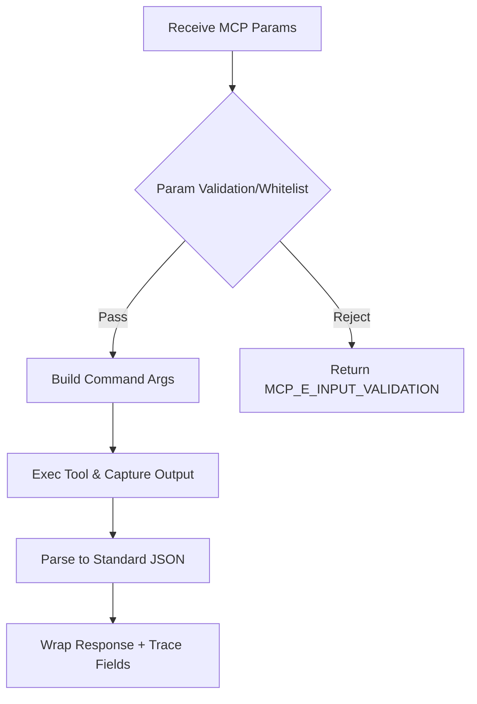

# Feature 1 · MCP Tool Wrappers (Nmap / Nuclei)

- **Requirement Source**: [PRD.md:L156-L165](file:///d:/PaperDesign/MCP_scan/docs/PRD.md#L156-L165)
- **Technical Basis**: Command Sanitization Layer [TSD.md:L67-L70](file:///d:/PaperDesign/MCP_scan/docs/TSD.md#L67-L70), Tool-as-a-Service [TSD.md:L59-L62](file:///d:/PaperDesign/MCP_scan/docs/TSD.md#L59-L62)
- **Project Structure Reference**: [PROJECT_STRUCTURE_SIMPLIFIED.md:L61-L75](file:///d:/PaperDesign/MCP_scan/docs/PROJECT_STRUCTURE_SIMPLIFIED.md#L61-L75)
- **Traceability Placeholder**: `commit=COMMIT_TBD`

## Functional Positioning & Business Goals
- Encapsulate Nmap and Nuclei as MCP capabilities, providing unified input/output and error handling.
- Standardized invocation for AI/CLI without needing to know tool flags and output differences.
- Security First: Mandatory input validation and command injection prevention; auditable structured JSON output.

## Input/Output Specification

### Capability 1: recon.port_scan (Nmap)
- **Input (JSON)**
  - `target`: string, required, IPv4/IPv6/CIDR (e.g., "192.168.1.0/24"), format validation: `^(\\d{1,3}\\.){3}\\d{1,3}(\\/\\d{1,2})?$|^([0-9a-fA-F:]+)(\\/\\d{1,3})?$`
  - `ports`: string|array, optional, port range or list (e.g., "1-1024" or [80,443]), range: 1-65535
  - `timing`: string, optional, enum: ["T0","T1","T2","T3","T4"], default "T3"
  - `service_detection`: boolean, optional, default false (corresponds to -sV)
  - `os_fingerprint`: boolean, optional, default false (corresponds to -O)
  - `max_rate`: integer, optional, unit pps, range: 100-100000
  - `exclude_hosts`: array[string], optional, exclude targets
  - `trace_id`: string, required, for distributed tracing and idempotency
- **Output (JSON)**
  - `success`: boolean
  - `code`: string (see Error Codes)
  - `message`: string
  - `trace_id`: string
  - `data`: object
    - `hosts`: array
      - `host`: string
      - `ports`: array
        - `port`: integer
        - `protocol`: string (enum: ["tcp","udp"])
        - `state`: string (enum: ["open","closed","filtered"])
        - `service?`: string
        - `version?`: string
      - `os?`: object
        - `name`: string
        - `accuracy`: integer (0-100)
  - `meta`: object
    - `tool`: "nmap"
    - `args`: string (sanitized)
    - `started_at`: string ISO8601
    - `finished_at`: string ISO8601

### Capability 2: exploit.nuclei_scan (Nuclei)
- **Input (JSON)**
  - `target`: string, required, URL/Host (e.g., "http://target.local")
  - `templates`: array[string], optional, template paths or IDs
  - `severity_min`: string, optional, enum: ["info","low","medium","high","critical"], default "low"
  - `tags`: array[string], optional, template tag filtering
  - `rate_limit`: integer, optional, range: 1-1000
  - `trace_id`: string, required
- **Output (JSON)**
  - `success`, `code`, `message`, `trace_id` same as above
  - `data`: object
    - `findings`: array
      - `id`: string
      - `name`: string
      - `severity`: string (same enum)
      - `cve?`: string
      - `description?`: string
      - `evidence`: object
        - `matcher_name?`: string
        - `extracted_results?`: array[string]
      - `target`: string
      - `timestamp`: string ISO8601
  - `meta`:
    - `tool`: "nuclei"
    - `args`: string
    - `started_at` / `finished_at`

## Core Algorithms / Business Rules

### Pseudo-code (Nmap Wrapper)
```text
function run_port_scan(input):
  validate(input.target, input.ports, input.timing, ...)
  sanitized = sanitize(input)  // Allow only whitelist characters and safe combinations
  args = build_nmap_args(sanitized)
  result = exec(args, timeout=derive_timeout(input))
  parsed = parse_nmap_output(result)
  return wrap_response(parsed, trace_id=input.trace_id)
```

### Pseudo-code (Nuclei Wrapper)
```text
function run_nuclei_scan(input):
  validate(input.target, input.templates, input.severity_min, ...)
  sanitized = sanitize(input)
  args = build_nuclei_args(sanitized)
  result_stream = exec_stream(args)   // Optional SSE
  findings = parse_nuclei_jsonl(result_stream)
  return wrap_response(findings, trace_id=input.trace_id)
```

### Flowchart (Mermaid)


## Exceptions & Error Codes
- `MCP_E_INPUT_VALIDATION`: Invalid parameters (Trigger: format/range mismatch; Recovery: prompt correction, example values)
- `MCP_E_SECURITY_POLICY`: Command injection risk (Trigger: blacklist hit; Recovery: reject execution and log audit)
- `MCP_E_TOOL_NOT_FOUND`: Tool missing (Trigger: not found in PATH; Recovery: return installation guide)
- `MCP_E_TIMEOUT`: Execution timeout (Trigger: exceeds time limit; Recovery: suggest lowering scope or increasing timing)
- `MCP_E_PARSE_ERROR`: Output parsing failure (Trigger: unexpected output structure; Recovery: attach raw snippet and fallback to simplified parsing)
- `MCP_E_RATE_LIMITED`: Rate limited (Trigger: exceeds rate_limit; Recovery: queue or lower rate)
- `MCP_E_INTERNAL`: Unknown exception (Trigger: uncaught error; Recovery: log trace_id and context)

## Performance Metrics
- **Response (ACK) Time**: ≤ 100ms (excluding tool execution)
- **Concurrency**: ≥ 10 concurrent wrapper invocations
- **Resource Usage**: Single wrapper peak memory ≤ 200MB; CPU usage configurable
- **Timeout Strategy**: Default 120s, adaptive based on target scale

## Traceability
- **Requirement Source**: [PRD.md:L156-L165](file:///d:/PaperDesign/MCP_scan/docs/PRD.md#L156-L165)
- **Code Location (Reference)**:
  - [nmap_wrapper.py](file:///d:/PaperDesign/MCP_scan/servers/recon/tools/nmap_wrapper.py) · `commit=COMMIT_TBD`
  - [nuclei_wrapper.py](file:///d:/PaperDesign/MCP_scan/servers/exploit/tools/nuclei_wrapper.py) · `commit=COMMIT_TBD`
