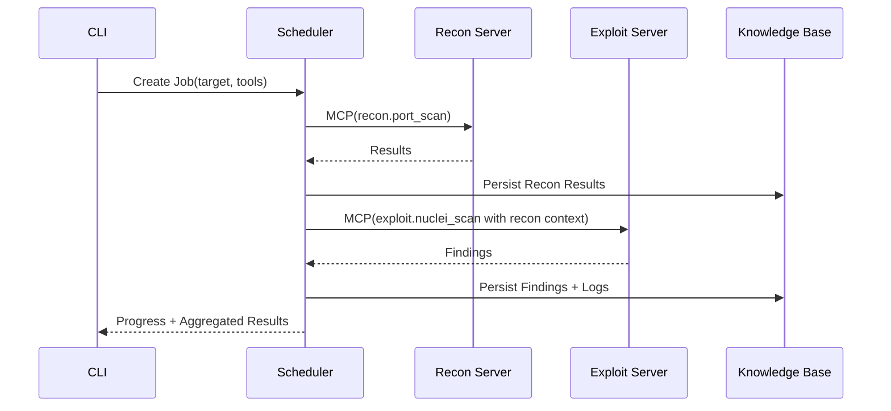

# Feature 2 · Basic Task Scheduling (Sequential Execution)

- **Requirement Source**: [PRD.md:L167-L175](file:///d:/PaperDesign/MCP_scan/docs/PRD.md#L167-L175)
- **Technical Basis**: DAG Scheduling [TSD.md:L63-L66](file:///d:/PaperDesign/MCP_scan/docs/TSD.md#L63-L66), System Workflow [TSD.md:L80-L86](file:///d:/PaperDesign/MCP_scan/docs/TSD.md#L80-L86)
- **Project Structure Reference**: `core/scheduler/` (dag_builder, distributed_executor)
- **Traceability Placeholder**: `commit=COMMIT_TBD`

## Functional Positioning & Business Goals
- Baseline sequential execution: Recon → Exploit.
- Ensure task failure does not crash the scheduler, and include failure context in logs and subsequent task decisions.
- Automatically inject results from Task N into the input context of Task N+1.
- Persist execution logs to disk, while writing summaries to the Knowledge Base (Redis/JSON).

## Input/Output Specification

### Job Creation (CLI/REST)
- **Input (JSON)**
  - `job_id`: string, required (provided by client to support idempotency)
  - `target`: string, required (IPv4/IPv6/CIDR/URL)
  - `tools`: array[string], required (e.g., ["nmap","nuclei"])
  - `stages`: array[object], optional (default generation: port_scan → nuclei_scan)
    - `name`: string (capability name: recon.port_scan / exploit.nuclei_scan)
    - `params`: object (capability params, see Feature 1)
    - `depends_on`: array[string] (default linear)
  - `options`: object, optional (retries, concurrency, timeout, etc.)
  - `trace_id`: string, required
- **Output (JSON)**
  - `job_id`, `status` (queued|running|completed|failed|canceled)
  - `created_at`, `updated_at`
  - `summary`: object (stage count, estimated duration)

### Job Status Query
- **Input**: `job_id` (path)
- **Output**:
  - `progress`: number (0-100)
  - `current_stage`: string
  - `events`: array[LogEntry]
  - `last_error?`: object (code, message, details, trace_id)

### Result Aggregation
- **Input**: `job_id`
- **Output**:
  - `recon_results`: ScanResult[]
  - `exploit_findings`: NucleiFinding[]
  - `artifacts`: array[string] (exported file paths)

## Core Algorithms / Business Rules

### Pseudo-code (Sequential Scheduling)
```text
function run_job(job):
  for stage in job.stages:
    ctx = derive_context_from_previous(stage, job.context)
    try:
      output = invoke_capability(stage.name, ctx.params)
      persist_result(job.job_id, stage.name, output)
      job.context = merge(job.context, output)
      update_progress(job, stage)
    except Error as e:
      log_error(job.job_id, stage.name, e)
      if options.retry_left(stage) > 0:
        retry(stage)
      else:
        continue  // Failure does not crash, proceed to next stage (configurable)
  finalize_job(job)
```

### Sequence Diagram (Mermaid)


## Exceptions & Error Codes
- `SCH_E_STAGE_FAILURE`: Stage execution failed (Trigger: wrapper returned error; Recovery: log and proceed to next stage / configurable retry)
- `SCH_E_RESULT_UNAVAILABLE`: Dependency result missing (Trigger: upstream no data; Recovery: degrade execution or skip)
- `SCH_E_LOG_PERSIST_FAIL`: Log persistence failed (Trigger: disk/permission issue; Recovery: fallback to memory + alert)
- `SCH_E_CONTEXT_MERGE_ERROR`: Context merge error (Trigger: structure conflict; Recovery: use last valid snapshot)
- `SCH_E_INTERNAL`: Scheduler unknown error (Trigger: uncaught; Recovery: isolate Job and keep recoverable point)

## Performance Metrics
- **Status Query Response**: ≤ 50ms
- **Scheduling Overhead**: Single stage scheduling delay ≤ 20ms (excluding tool execution)
- **Concurrent Jobs**: ≥ 10 (Local Simplified Version)
- **Persistence**: Log write to disk ≤ 30ms/entry; KB aggregation ≤ 50ms

## Traceability
- **Requirement Source**: [PRD.md:L167-L175](file:///d:/PaperDesign/MCP_scan/docs/PRD.md#L167-L175)
- **Code Location (Reference)**:
  - [dag_builder.py](file:///d:/PaperDesign/MCP_scan/core/scheduler/dag_builder.py) · `commit=COMMIT_TBD`
  - [distributed_executor.py](file:///d:/PaperDesign/MCP_scan/core/scheduler/distributed_executor.py) · `commit=COMMIT_TBD`
