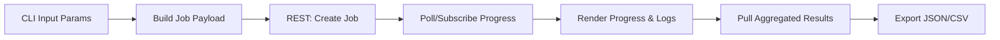

# Feature 3 · Terminal CLI

- **Requirement Source**: [PRD.md:L177-L186](file:///d:/PaperDesign/MCP_scan/docs/PRD.md#L177-L186)
- **Technical Basis**: CLI → Scheduler → Server [TSD.md:L80-L86](file:///d:/PaperDesign/MCP_scan/docs/TSD.md#L80-L86)
- **Project Structure Reference**: [PROJECT_STRUCTURE_SIMPLIFIED.md:L89-L96](file:///d:/PaperDesign/MCP_scan/docs/PROJECT_STRUCTURE_SIMPLIFIED.md#L89-L96)
- **Traceability Placeholder**: `commit=COMMIT_TBD`

## Functional Positioning & Business Goals
- Provide a unified command: `mcp_scan --target <IP> --tools nmap,nuclei` to initiate scans.
- Real-time progress display (tasks, percentage, ETA, log summary), consistent with security professional habits.
- Structured result display with JSON/CSV export support; comprehensive `--help` documentation.

## Input/Output Specification

### CLI Commands & Parameters
- **Command**: `mcp_scan scan`
  - **Parameters**:
    - `--target <string>` required (IPv4/IPv6/CIDR/URL)
    - `--tools <string>` required (comma-separated, e.g., `nmap,nuclei`)
    - `--ports <string>` optional (e.g., `1-1024` or `80,443`)
    - `--severity-min <string>` optional (enum: info|low|medium|high|critical)
    - `--export <string>` optional (json|csv; default json)
    - `--trace-id <string>` optional (default auto-generated UUID)
    - `--verbose` optional (show detailed logs)
    - `--help` show help
- **Output**:
  - Terminal Rich table/progress bar/logs
  - Export file: `./outputs/<job_id>.<json|csv>`

### Result Viewing
- **Command**: `mcp_scan results --job-id <id> --format json|csv`
- **Output**: Aggregated results (same as Scheduler "Result Aggregation" output)

### Help Documentation
- **Command**: `mcp_scan --help` or subcommands `scan --help`, `results --help`
- **Output**: Parameter descriptions, examples

## Core Algorithms / Business Rules

### Pseudo-code
```text
command scan(options):
  job_id = ensure_idempotency(options.trace_id)
  payload = build_job_payload(options)
  ack = POST /api/v1/jobs {payload}
  while not done:
    progress = GET /api/v1/jobs/{job_id}
    render(progress)
    sleep(500ms)
  results = GET /api/v1/jobs/{job_id}/results?format=options.export
  save(results, file_path)
  print(summary)
```

### Flowchart (Mermaid)


## Exceptions & Error Codes
- `CLI_E_ARGS_INVALID`: Parameter validation failed (Trigger: invalid format; Recovery: output help and examples)
- `CLI_E_NETWORK_ERROR`: Network exception (Trigger: REST request failed; Recovery: retry and prompt)
- `CLI_E_RESULT_EXPORT_FAIL`: Export failed (Trigger: file write error; Recovery: prompt path and permissions)
- `CLI_E_INTERNAL`: Unknown exception (Trigger: uncaught; Recovery: print trace_id and minimal reproducible info)

## Performance Metrics
- **Create Job Request Response**: ≤ 100ms
- **Progress Polling**: 500ms interval; SSE (optional) latency ≤ 100ms
- **Export File Generation**: ≤ 200ms (within 10k records)

## Traceability
- **Requirement Source**: [PRD.md:L177-L186](file:///d:/PaperDesign/MCP_scan/docs/PRD.md#L177-L186)
- **Code Location (Reference)**:
  - [cli.py](file:///d:/PaperDesign/MCP_scan/client/cli.py) · `commit=COMMIT_TBD`
