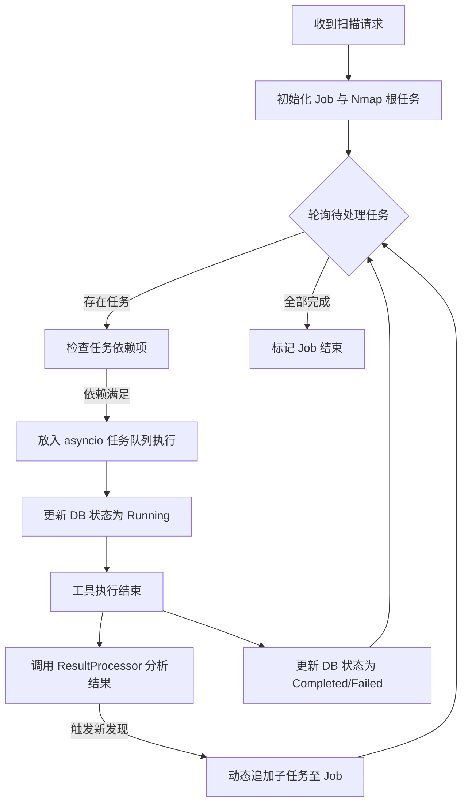

# 第六章 系统的详细设计与实现

## 6.1 CLI 扫描交互控制模块
### 6.1.1 界面说明
该模块是系统的用户入口，采用基于 Python `Click` 库的命令行界面，并结合 `Rich` 库实现动态仪表盘。
- **启动模式**：通过 `mcp_scan start --target <IP>` 启动。界面会显示彩色标题、作业 ID 以及一个动态更新的任务状态进度表。
- **动态渲染**：利用 `Rich.Live` 渲染技术，每 0.5 秒更新一次界面，实时同步调度器内存中的任务状态。
- **状态提示**：使用颜色区分任务状态：绿色代表完成，蓝色代表运行中，红色代表失败。

### 6.1.2 关键代码实现
```python
# mcp_scan/cli.py - 实时状态表格渲染逻辑
def generate_status_table(job_id: UUID) -> Table:
    job = scheduler.get_job(job_id)
    if not job:
        return Panel(f"[red]Job {job_id} not found[/red]")

    table = Table(title=f"Scan Status: {job.target} [{job.status.value}]")
    table.add_column("Task ID", style="dim", width=8)
    table.add_column("Tool", style="cyan")
    table.add_column("Status")
    table.add_column("Info")

    for task in job.tasks:
        status_color = {
            "completed": "green", 
            "running": "blue", 
            "failed": "red"
        }.get(task.status.value, "yellow")
        
        info = "[red]Error[/red]" if task.error else "Done" if task.result else "Waiting"
        table.add_row(
            str(task.id)[:8],
            task.tool_name,
            f"[{status_color}]{task.status.value}[/{status_color}]",
            info
        )
    return table
```

---

## 6.2 任务异步调度管理模块
### 6.2.1 任务分发流程图
调度器（Scheduler）是系统的核心引擎，负责维护任务依赖的有向无环图（DAG）。



### 6.2.2 核心逻辑实现
```python
# mcp_scan/core/scheduler.py - 核心调度循环
async def run_job(self, job_id: UUID):
    job = self.jobs.get(job_id)
    while True:
        pending_tasks = [t for t in job.tasks if t.status == TaskStatus.PENDING]
        if not pending_tasks and not self._has_running_tasks(job):
            break 

        ready_tasks = [t for t in pending_tasks if self._check_deps(t, job)]
        for task in ready_tasks:
            task.status = TaskStatus.RUNNING
            # 异步执行单个工具，不阻塞主循环
            asyncio.create_task(self._execute_task(job, task))
        
        await asyncio.sleep(1)
```

---

## 6.3 安全工具适配与包装模块
### 6.3.1 模块活动图
工具包装层负责将上层的参数对象转换为底层二进制工具可见的命令行指令，并捕获输出。

```mermaid
activityDiagram
    start
    :接收工具参数 (target, ports, etc.);
    :执行参数清洗 (防止命令注入);
    :构造 CLI 命令字符串 (e.g., nmap -sV ...);
    :调用 CommandExecutor (Subprocess);
    if (超时或系统错误?) then (是)
        :设置失败状态并记录错误;
    else (否)
        :捕获 stdout/stderr;
        :解析原始文本为结构化 JSON;
    endif
    :返回标准化结果字典;
    stop
```

### 6.3.2 关键代码实现（Nmap 包装器）
```python
# mcp_scan/tools/nmap_tool.py
def run_nmap(target: str, ports: str = "top-1000") -> Dict[str, Any]:
    # 逻辑：参数清洗与命令构造
    if ";" in target or "|" in target:
        return {"error": "Invalid target", "success": False}
        
    command = f"nmap -T3 --top-ports {ports} {target}"
    executor = CommandExecutor(command, timeout=300)
    
    # 执行并标准化
    process_res = executor.execute()
    process_res["success"] = (process_res["return_code"] == 0)
    return process_res
```

---

## 6.4 数据持久化与模型管理模块
### 6.4.1 实现说明
该模块利用 MySQL 的原生 JSON 支持实现半结构化存储。
- **Pydantic 模型**：定义 Job 和 Task 的数据模型，负责内存中的序列化与校验。
- **幂等性保存**：`save_job` 方法采用 `ON DUPLICATE KEY UPDATE` 模式，确保任务状态更新的原子性。

### 6.4.2 关键代码实现
```python
# mcp_scan/core/db.py - 持久化逻辑
def save_job(self, job: Job):
    # 将模型转为 JSON 字符串
    result_data = job.model_dump_json()
    
    query = """
        INSERT INTO job_results (job_id, status, result_data, updated_at)
        VALUES (%s, %s, %s, NOW())
        ON DUPLICATE KEY UPDATE 
            status=VALUES(status), 
            result_data=VALUES(result_data), 
            updated_at=NOW()
    """
    with self.pool.get_connection() as conn:
        cursor = conn.cursor()
        cursor.execute(query, (str(job.id), job.status.value, result_data))
        conn.commit()
```

---

## 6.5 节点通信与分布式接口模块（选配）
### 6.5.1 模块功能描述
在分布式场景下，调度器作为 Hub，通过 `transport` 模块下发任务。
- **心跳机制**：节点通过 `POST /api/node/heartbeat` 每 30 秒同步一次状态。
- **任务拉取/推送**：支持调度器主动推送任务到 Node。
- **日志流**：利用 WebSocket 实时将远端工具的 stdout 回传给 CLI 展示。
